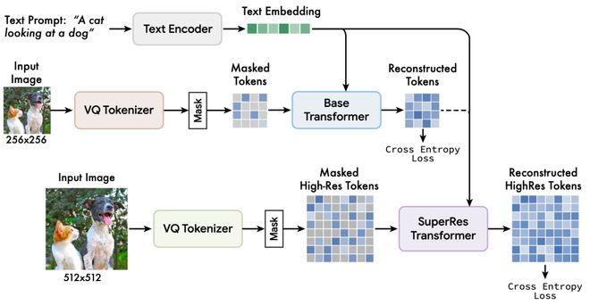

Muse模型的文本到图像生成原理基于将大型预训练语言模型（如T5-XXL）提取的文本嵌入与图像tokens结合的方法。具体过程如下：

1. **文本编码**：Muse首先使用T5-XXL模型将输入的文本描述编码成高维语言嵌入向量。
2. **离散图像Token化**：使用VQGAN模型将图像编码为离散的Token序列。这些Token捕获图像的高级语义信息。
3. **遮蔽建模**：Muse的核心是一个遮蔽转换模型，它接受部分遮蔽的图像Token和完整的文本嵌入。模型通过预测被遮蔽的图像Token来训练。
4. **迭代解码**：在推理时，Muse通过迭代过程逐步揭露和生成被遮蔽的图像部分，从而创建与文本描述相匹配的完整图像。

通过这种结合预训练语言模型的高级文本理解和VQGAN的高效图像Token化，Muse能够生成与文本描述高度一致的逼真图像。
